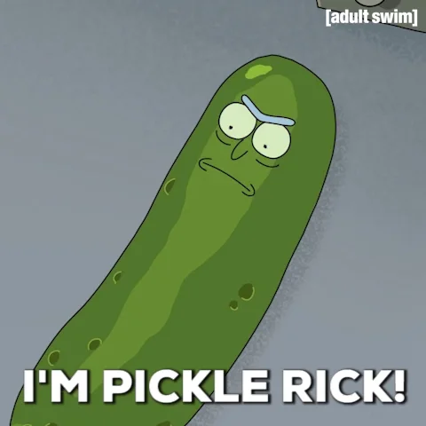

# Big scale_Team Rolex ⌚

**WEB APPLICATION** 👉 https://rich-wavelet-306313.oa.r.appspot.com/

**Team members**

 - Déborah Hernandez 
 - Simon Fellner 
 - Maxime Dubi

This repository contains all the work done by the group Rolex for the project of Big Scale Analytics 2021.

## Project description 🗂️

The goal of the project is to build a model for predicting the difficulty level of a french sentence. The level concerns the reading understanding of the sentence for a native english speaker. The levels are ranked from A1 which correspond to beginner, to C1 which correspond to proficiency. 

We intend to assess the problem by building a text classifier which, based on the learning sentences we built, would suggest the language level of the sentence. 

## Methodology 🤓 

## 📚 Literature

Do some literature reserach that could help us solve the problem : 

***Articles:***

- Flanagan, B., Hirokawa, S., Kaneko, E., & Izumi, E. (2017). Classification of Speaking Proficiency Level by Machine Learning and Feature Selection
- Preciado-Grijalva, A., & Brena, R. F. (2018). Speaker Fluency Level Classification Using Machine Learning Techniques
- Xiaoyu Bai (2018). Automatic Classification of English Learner Proficiency Using Elicited Versus Spontaneous Data

***Websites***

- https://monkeylearn.com/text-classification/
- https://medium.com/swlh/language-classification-using-machine-learning-in-python-fa0768daea67

## 📊 Dataset

Collect the dataset : 

The labelled data is uploaded in our repository as CSV. 

***Sentences dataset***
 - A1 : 199 | 16%
 - A2 : 228 | 18%
 - B1 : 223 | 17%
 - B2 : 228 | 18%
 - C1 : 203 | 16%
 - C2 : 200 | 16%
 
 ***TOTAL : 1281***
 
There are more than 1000 sentences, but for the model building, we'll keep 200 sentences per level.

We collected the french sentences from websites with exercices for non-french speakers and from articles about specific topics : 

***Language exercises***

- https://lingua.com/fr/francais/lecture/
- https://www.leplaisirdapprendre.com/portfolio/selection-activites-comprehension-ecrite-a1-a2-b1-b2/
- https://www.podcastfrancaisfacile.com/tag/intermediaire+texte
- https://www.francepodcasts.com/
- https://www.france-education-international.fr/sites/default/files/atoms/files/dalf-c2_sujet-demo1_candidat_coll_pe.pdf

***Books or movies citations***

- https://scripts.fandom.com/fr/wiki/OSS_117_:_Le_Caire,_nid_d%27espions
- https://www.gqmagazine.fr/pop-culture/cinema/diaporama/100-rpliques-cultes/725?image=5b992a115e8dfe001124c9a5
- https://dicocitations.lemonde.fr/citation.php?mot=these
- http://mapage.noos.fr/r.ferreol/langage/archiduchesse.html

***Thesis***

- http://www.theses.fr/fr/?q=

***Dictionary***

- https://www.hobbesworld.com/dico/mots.php

***Specific articles***

- https://www.linternaute.com/
- https://www.wikipedia.fr/
- Solange Ghernaouti (2016) Cybersécurité - 5e éd.: Sécurité informatique et réseaux
 

To label the data with the difficulty levels, we found some criterias in the internet : 

 - https://www.worddy.co/fr/magazine/connaitre-son-niveau-de-langue-selon-cecrl
 - https://www.france-langue.fr/niveaux-de-francais/
 - http://www.provincedeliege.be/sites/default/files/media/7476/Europass_-_European_language_levels_-_Self_Assessment_Grid.pdf

## 🖥️ API and UI

To create the API, we worked with app engine and the automMl API. We coded a python code to make a functionnal API. We made some HTML code to create the UI and make it look fancy. 

Our callable API and UI can be found in this link : https://rich-wavelet-306313.oa.r.appspot.com/

## Models

We created various model to assess the problem of classifying the sentences. They are explained and evaluated below. 
Note : All our F1 scores are based on a threshold score of 0.5.

### Model A (Natural Language)

For our first model, we used google cloud services to classify the data. We only uploaded our dataset on AutoMl from natural language. 
It is possible to adjust the sensibility of the model by balancing the precision and recal rate. 

***Results of the model with our dataset***

- The overall accuracy of the model is 54.69%
- The overall recall of the model is 46.09%
- The F1 score of the model is 51.30%
- The per-class scores are : 

- The confusion Matrix of the model is : 

***Results of the model with AIcrowd dataset***

- The overall accuracy of the model is 51.67%
- The overall recall of the model is 41.46%
- The F1 score of the model is 49.02%
- The confusion Matrix of the model is : 

### Model B (Natural Language +)

To increase the accuracy of the model, we made some feature engineering still with Natural Language. To do so, we used : 

- The total number of words of the phrase 
- The list of cognates present in the phrase
- The number of cognates in the phrase
- The ratio of cognates in the phrase (number of cognates over total number of words)
- The number of punctuation

To find the cognates in the phrases, we reused the exercise of the course's assignment where we had to find the cognates with the highest term frequency in english (not considering those where the difference between the term frequency in French and in English exceed 1,000,000). We cleaned the cognates dictionnary to delete the numbers. We buidt a table with 500,000 cognates. 

***Results of the model with our dataset***

- The overall accuracy of the model is 42.60%
- The overall recall of the model is 31.25%
- The F1 score of the model is 36.36%
- The confusion Matrix of the model is : 

We note that this model did not improve our results. Indeed, we don't have a lot of information about how AutoML works and how it creates the models. Thanks to this model, we understood that it does not interpret the different features, it only takes into account the meaning of the phrase.

### Model C (Tables) 

We used the Tables module of google cloud platform. It allow us to sturucture our data per features. It supports different types of formats for each feature and detects the correlation with the target. Then it built the optimal model on several features as we can see in the picture below. 

***Results of the model with AIcrowd dataset***

- The overall accuracy of the model is 60.60%
- The overall recall of the model is 19.50%
- The F1 score of the model is 29.50%
- The confusion Matrix of the model is : 

As said before, we only decided to work with another module of google cloud and reusing only what we did for model 2, we see that the precision has improved a lot. 
Howerver we have a low recall. We think we can improve that by vectorizing the senteces. So we decided to improve our model. 

IMPROVEMENT

To improve the model 3, we decided to do some preprocess on our data. Here are the steps: 

- We tockenized the sentences with spacy 
- we extracted the cognates from the tokens
- We added features (number of tokens,...)
- We lematized our cognate's dictionnary. Indeed, our cognate's dictionnary was not of trust so we did a lematization that permited us having a more optimized list of cognates (310,508 cognates). 

***Results of the model with AIcrowd dataset***

- The overall accuracy of the model is 64.80%
- The overall recall of the model is 16.10%
- The F1 score of the model is 25.80%
- The confusion Matrix of the model is : 

### Model D (Tfidf)

We decided to vectorize the sentences with Tfidf. So we trained the data, we created the vector and exported it with the Pickle Module. 
Unfortunately this Model did not work as google AutoML Tables do not support more than 1000 columns and we had more.

### Model E (Word/Word)

The idea of this model is to tokenize each phrase and to create one row for each tocken and the associated level of this word. 

### Final Model 

The final model will be a combination of the best models, so that we will have a doble prediction to pic the best score of prediction between the two models. 
We chose Model A (Natural Language) and Model C (Table) 

Indeed, we noticed that the model A is good at predicting the extremities (level A1 and C2) but is more hesitating in the intermediary levels. So we will use the model C to decide between levels A2 to C1.

To proceed in combining those two models, we firstly established an algorithm predicting a sentence in model A and in model C. This algorithm wil then select the prediction with the highest score. This method worked well, but we figured a way to improve this way to work.

We build a "Monitoring" model, in which we enter all the scores predicted from both model A and C. To achieve a proper model building, we split the training model in a 3000 lines and a 1800 lines datasets. The 3000 lines datasets were used to build a model A and a model C, and the 1800 dataset to build the monitoring model.

***Results of the model***

- The overall accuracy of the model is 67.90%
- The overall recall of the model is 29.90%
- The F1 score of the model is 41.60%
- The confusion Matrix of the model is : 

Our final model has great results, indeed the accuracy is quite high and the recall is also better than for the previous models. So the F1 score is good. 
We are satisfied about this model!

## AIcrowd 

We faced a problem at the beggining because the batch.predict in google AutoML Table all the results were mixed. So we had to use Excel and Python solutions to be able to submit the right data. 

However, we were surprised about the results on AICrowd. Indeed, it does not correspond to the results we get on Google cloud for our final model. It is certainly due to the functionning of Google cloud. The prediction does not take the level with the higher confidence index but only the first level having the wanted threshold. 

## Colab

We joined our colab to the github. It contains the development  of the environment, the function batch predict and the construction of our cognates' dictionnary. 

## Workload

The repartition of the work within our group was the following: 

- Literature research : Maxime
- Dataset : Maxime & Déborah 
- Readme : Déborah 
- UI : Déborah & Simon
- Models : Simon
- Video preparation : Maxime

